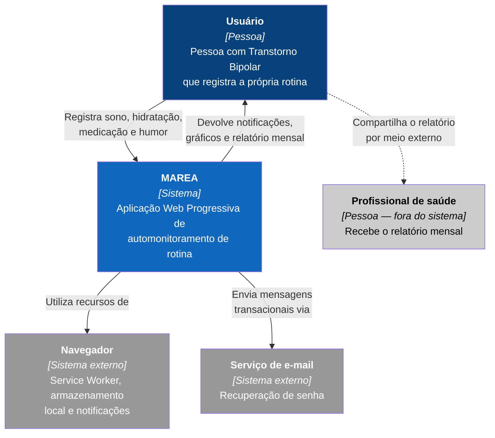
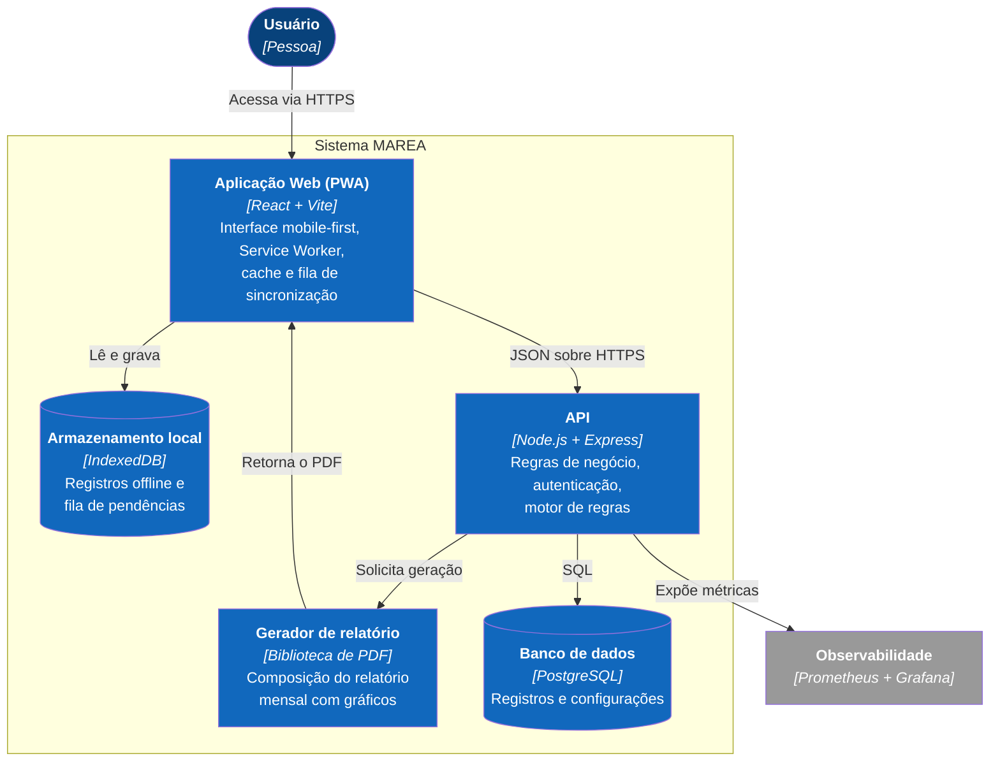
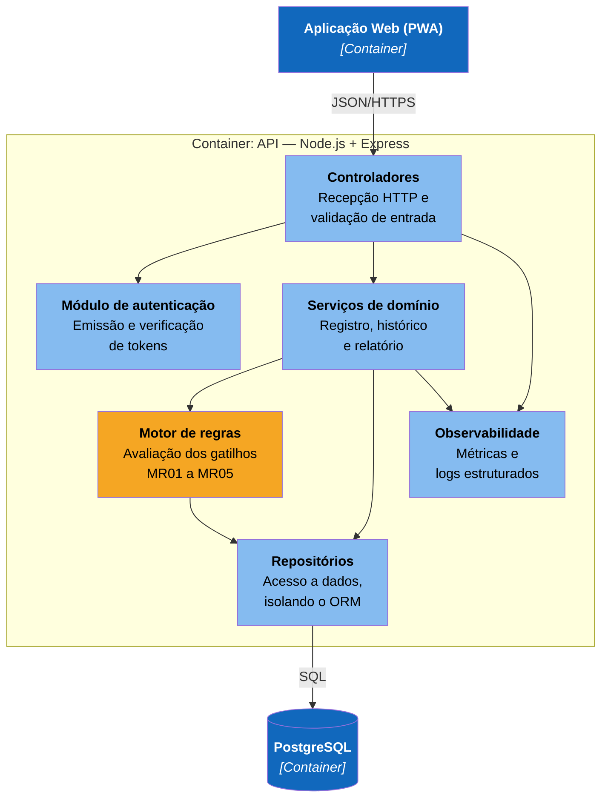
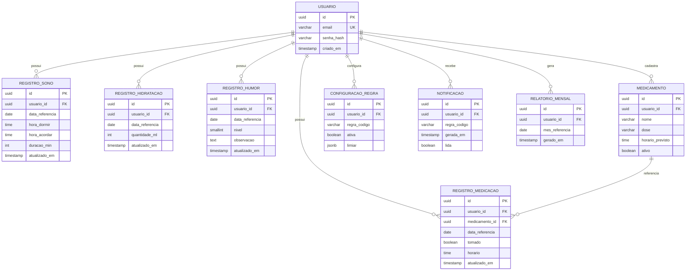

## 5. Arquitetura do Sistema

### 5.1 Diagrama C4

Os três níveis são apresentados a seguir, acompanhados da descrição textual correspondente.

**Nível 1 — Contexto**

- **Atores:** Usuário (pessoa com TB). O profissional de saúde é destinatário externo do relatório, não usuário do sistema.
- **Sistema:** MAREA.
- **Sistemas externos:** navegador do usuário (Service Worker, armazenamento local, API de notificações); serviço de e-mail transacional para recuperação de senha.
- **Fluxo de valor:** o usuário registra a rotina → o sistema processa, armazena e avalia regras → devolve notificações, gráficos e relatório mensal → o usuário compartilha o relatório com o profissional por meio externo.

**Nível 2 — Containers**

| Container | Tecnologia | Responsabilidade |
|---|---|---|
| Aplicação Web (PWA) | React + Vite | Interface mobile-first, Service Worker, cache e armazenamento local |
| API | Node.js + Express | Regras de negócio, autenticação, persistência, motor de regras |
| Banco de dados | PostgreSQL | Persistência dos registros e das configurações |
| Serviço de relatório | Biblioteca de geração de PDF | Composição do relatório mensal com gráficos |

Comunicação entre a PWA e a API por JSON sobre HTTPS.

**Nível 3 — Componentes (dentro da API)**

- **Controladores** — recepção das requisições HTTP e validação de entrada.
- **Serviços de domínio** — regras de negócio de registro, histórico e relatório.
- **Motor de regras** — avaliação dos gatilhos MR01–MR05.
- **Repositórios** — acesso a dados, isolando o ORM do domínio.
- **Módulo de autenticação** — emissão e verificação de tokens.
- **Camada de observabilidade** — exposição de métricas e logs estruturados.

### 5.2 Modelo de Dados

Entidades principais:

| Entidade | Atributos principais |
|---|---|
| `usuario` | id, email, senha_hash, criado_em |
| `registro_sono` | id, usuario_id, data_referencia, hora_dormir, hora_acordar, duracao_min |
| `registro_hidratacao` | id, usuario_id, data_referencia, quantidade_ml |
| `registro_medicacao` | id, usuario_id, data_referencia, medicamento_id, tomado, horario |
| `medicamento` | id, usuario_id, nome, dose, horario_previsto, ativo |
| `registro_humor` | id, usuario_id, data_referencia, nivel, observacao |
| `configuracao_regra` | id, usuario_id, regra_codigo, ativa, limiar |
| `notificacao` | id, usuario_id, regra_codigo, gerada_em, lida |
| `relatorio_mensal` | id, usuario_id, mes_referencia, gerado_em |

Relacionamento predominante: `usuario` 1:N com todas as demais entidades.

### 5.3 Principais Componentes

- **PWA (frontend)** — telas de registro, histórico e relatório; Service Worker para cache e funcionamento offline; fila de sincronização.
- **API REST** — endpoints de autenticação, registros, configurações e relatório.
- **Motor de regras** — módulo isolado, sem dependência de framework, com alta cobertura de testes unitários.
- **Gerador de relatório** — composição do PDF mensal com gráficos.
- **Camada de persistência** — repositórios sobre PostgreSQL.
- **Pipeline de CI/CD** — build, testes, cobertura, análise estática e deploy.

### 5.4 Stack Tecnológica

| Tecnologia | Justificativa |
|---|---|
| **React + Vite** | Ecossistema maduro para SPA, com suporte consolidado a PWA via plugin de Service Worker e build otimizado. |
| **Node.js + Express** | Mesma linguagem no frontend e no backend, reduzindo custo de contexto em projeto individual; adequado a carga predominantemente de I/O. |
| **PostgreSQL** | Banco relacional em servidor, com suporte transacional e a tipos de data e hora adequados às séries temporais dos registros. |
| **Service Worker + IndexedDB** | Viabilizam o registro offline e a sincronização posterior (RF13, RF14). |
| **Jest / Vitest** | Execução dos testes unitários e apuração da cobertura exigida (RNF04). |
| **GitHub Actions** | Pipeline de CI/CD integrado ao repositório do projeto. |
| **SonarCloud** | Análise estática e de segurança do código (RNF10). |
| **Prometheus + Grafana** | Observabilidade e monitoramento em produção (RNF11). |
| **VPS em nuvem** | Hospedagem em ambiente produtivo público e estável (RNF07). |

**Decisões e alternativas consideradas**

| Decisão | Alternativa descartada | Justificativa |
|---|---|---|
| PostgreSQL | SQLite | Banco em disco local é vedado pelos critérios obrigatórios da linha Web Apps. |
| VPS | Vercel, Netlify, Render | Plataformas otimizadas para frontend estão vedadas pelos critérios da linha. |
| Deploy por pipeline | Deploy manual por SSH ou FTP | Deploy manual é vedado pelos critérios da linha. |
| PWA | Aplicativo nativo (Flutter) | Elimina a dependência de lojas e o custo de manutenção de duas bases de código. |
| Motor de regras determinístico | Modelo de aprendizado de máquina ou LLM | Previsibilidade em domínio de saúde, testabilidade e não exposição de dados sensíveis a terceiros. |

### 5.5 Princípios de Software Maduro

| Princípio | Aplicação no MAREA |
|---|---|
| **Disponibilidade** | Funcionamento offline via Service Worker mantém o registro possível mesmo com a API indisponível. |
| **Consistência** | Resolução de conflitos de sincronização por data de modificação mais recente (FA03). |
| **Resiliência** | Fila de sincronização com nova tentativa automática; degradação para modo somente leitura. |
| **Escalabilidade** | API sem estado, permitindo replicação horizontal. |
| **Teorema CAP** | Em cenário de partição, o sistema privilegia disponibilidade sobre consistência imediata: o registro local é sempre aceito e reconciliado depois. Trata-se de decisão adequada ao domínio, no qual perder o registro do usuário é mais grave que uma inconsistência temporária. |

---
