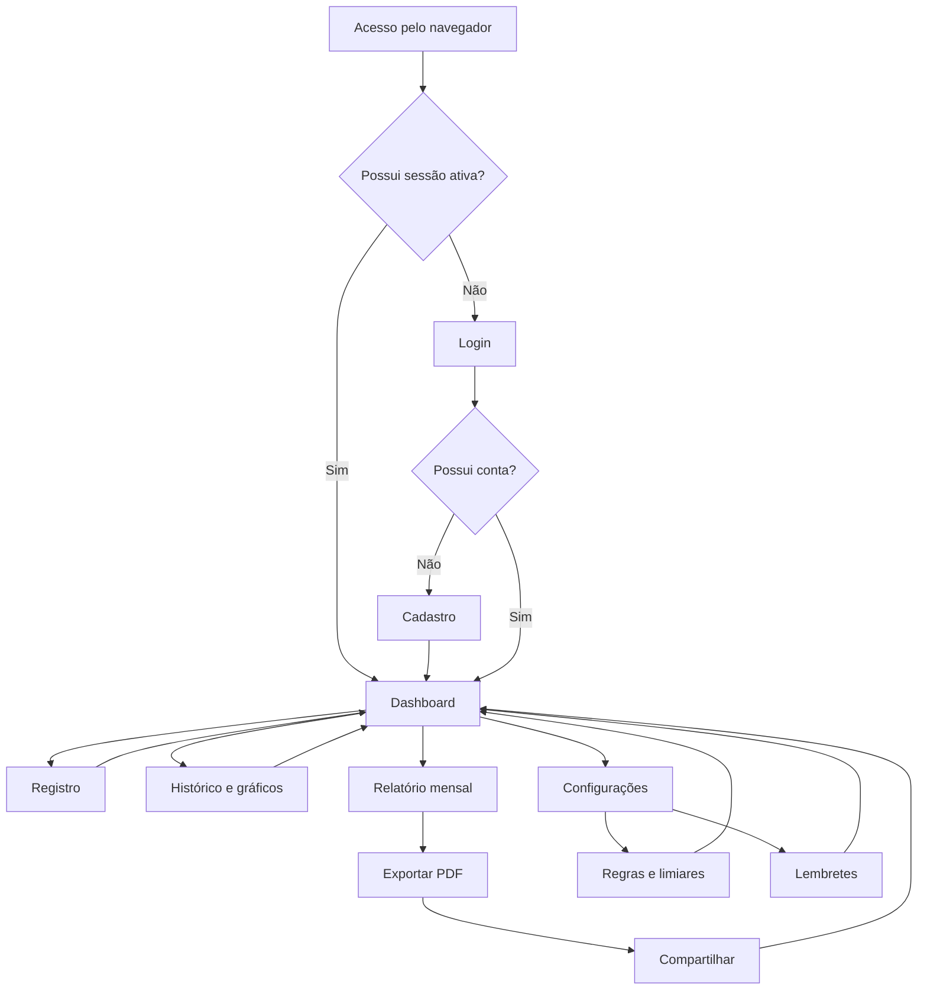
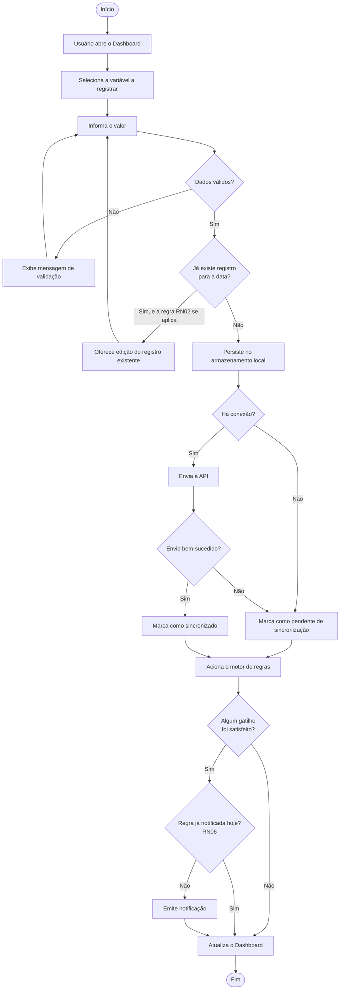
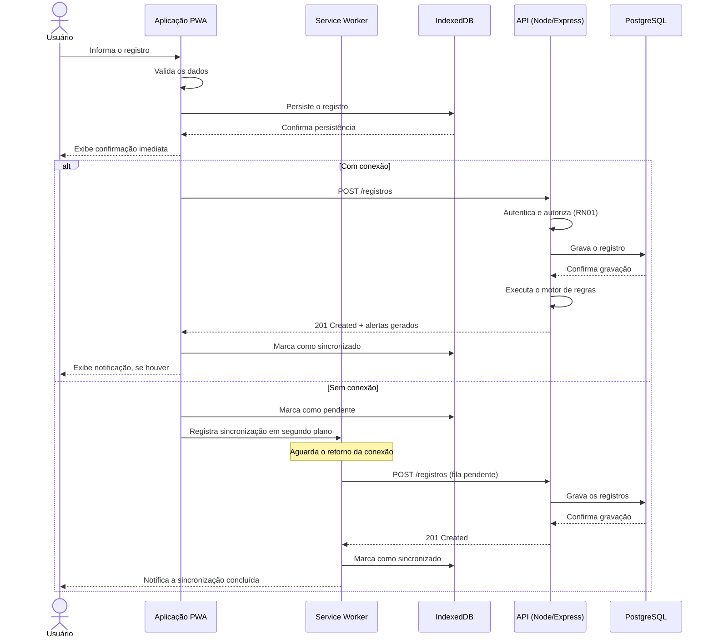
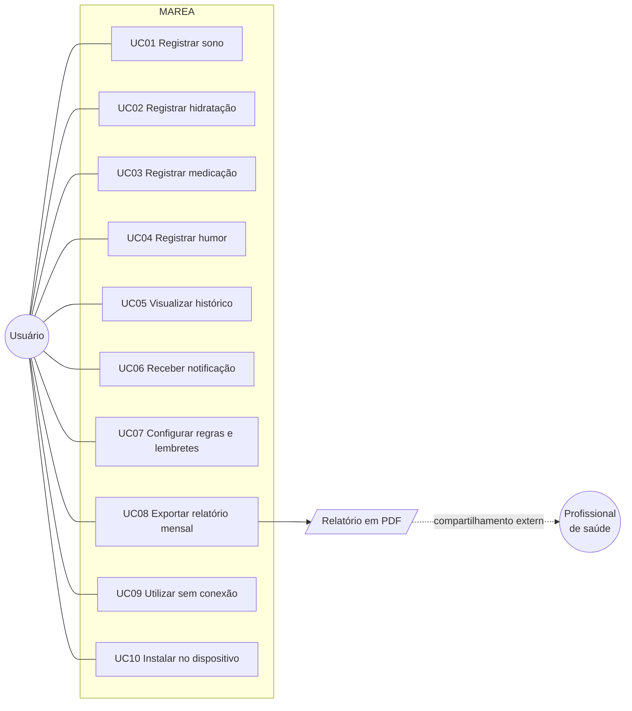
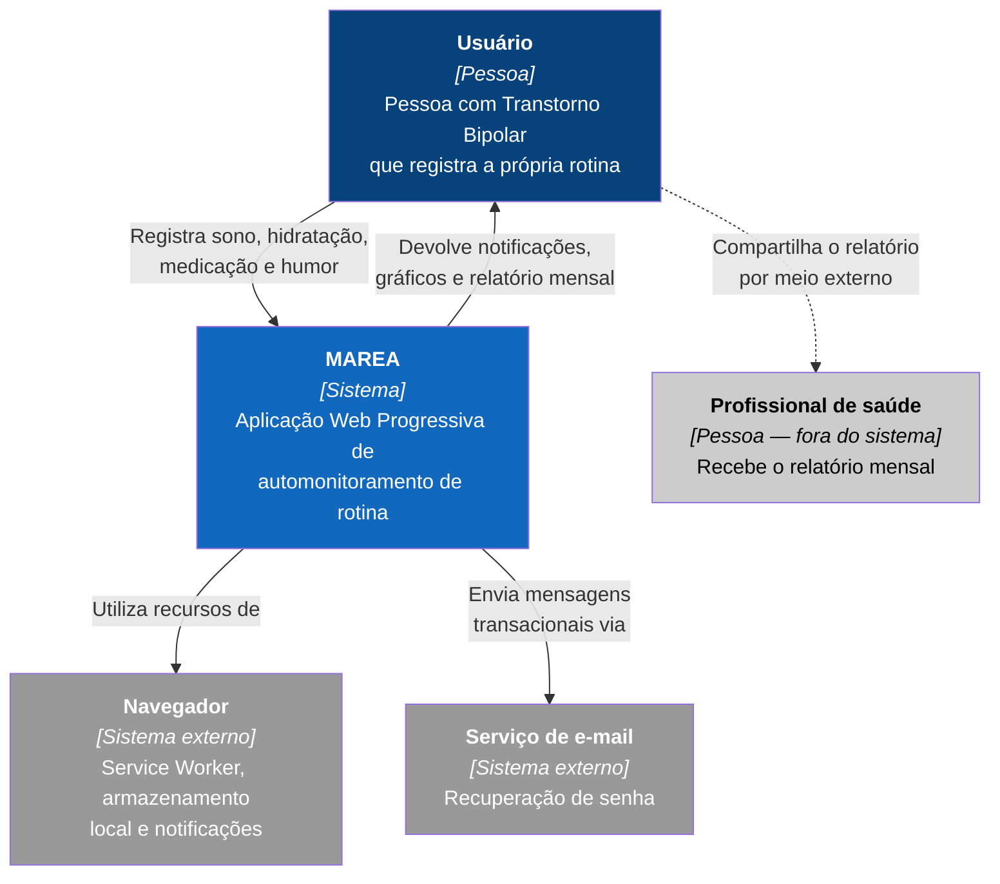
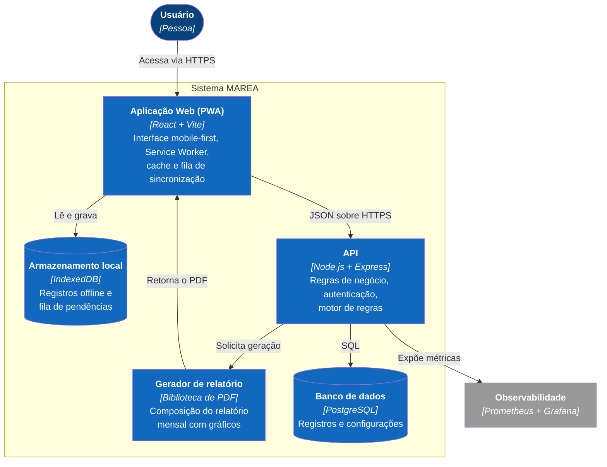
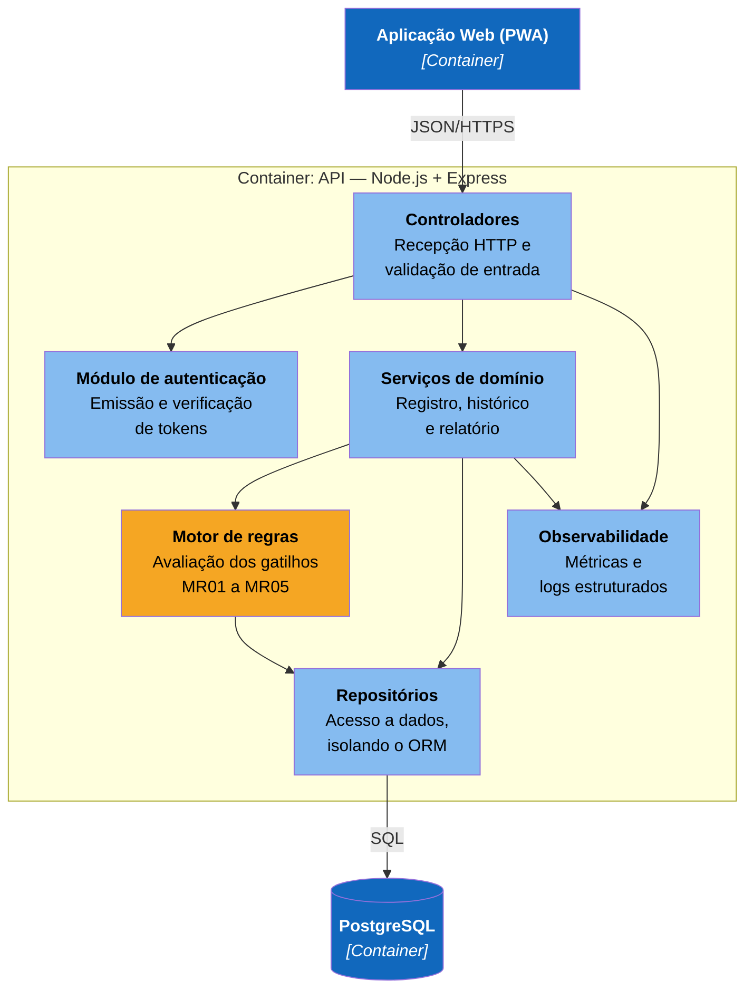
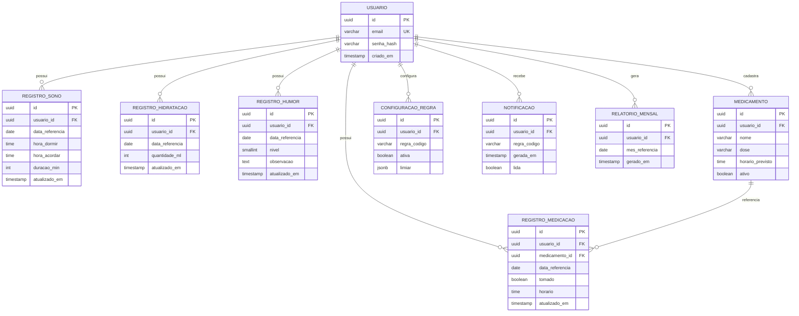
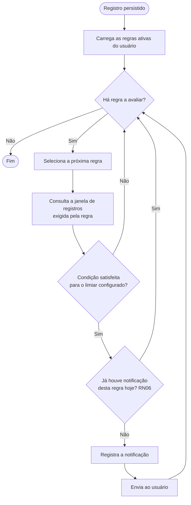

# Diagramas — MAREA

Código-fonte em Mermaid. O GitHub renderiza estes blocos nativamente em arquivos `.md` e na Wiki.

---

## 1. Fluxo de Navegação (§4.1)

---

## 2. Diagrama de Atividades — Registro Diário (§3.1)

---

## 3. Diagrama de Sequência — Registro com Sincronização (§3.1)

---

## 4. Diagrama de Casos de Uso (§2.2)

> O profissional de saúde não é ator do sistema: não possui conta nem acesso. Recebe o relatório por meio externo, por ação deliberada do usuário.

---

## 5. C4 — Nível 1: Contexto (§5.1)

---

## 6. C4 — Nível 2: Containers (§5.1)

---

## 7. C4 — Nível 3: Componentes da API (§5.1)

> O **motor de regras** aparece destacado por ser o componente com maior exigência de cobertura de testes unitários (RNF04) e por concentrar a lógica de domínio específica do produto.

---

## 8. Modelo de Dados — DER (§5.2)

---

## 9. Motor de Regras — Fluxo de Avaliação (§2.5)

